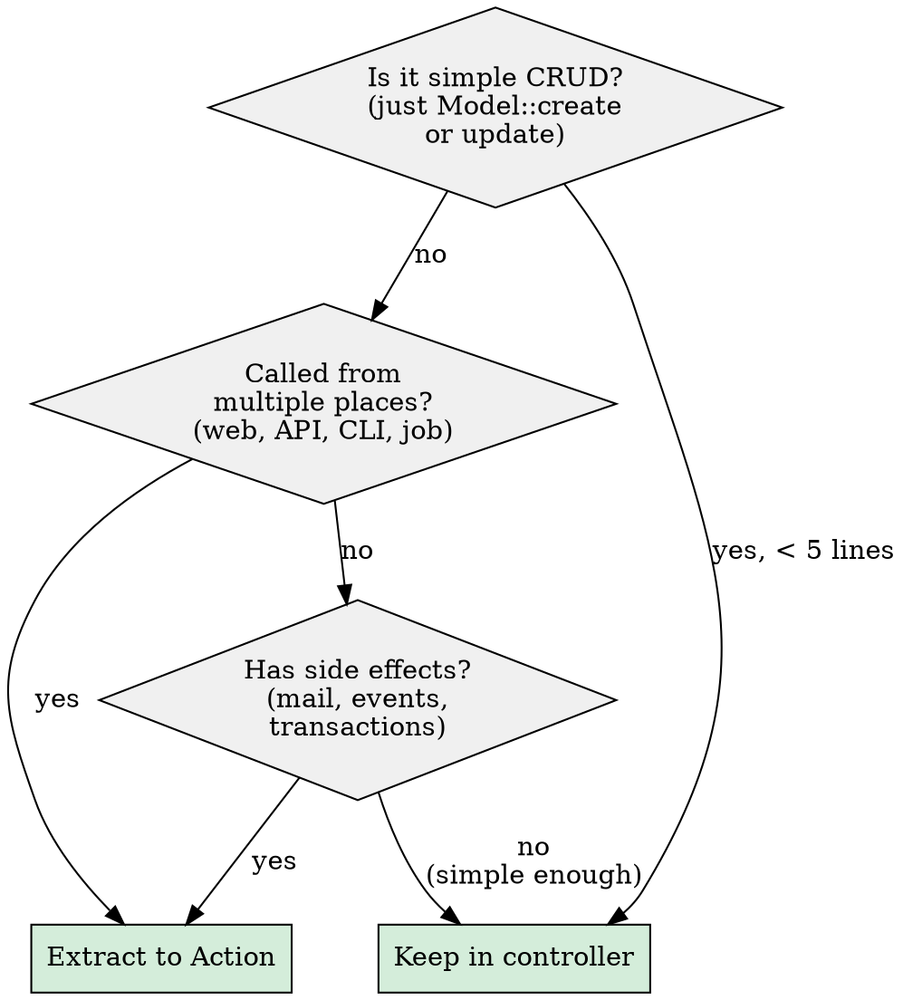

# Laravel 12+ Architecture — Actions Pattern

**Announce at start:** "I'm using the laravel-architecture skill to enforce clean architecture."

## Mode Detection

If user asks to "review", "audit", or "check architecture" of existing code, switch to **Review Mode** (see below). Otherwise, operate in **Implementation Mode**.

## Where Each Concern Belongs

| Layer | Responsibility | Max scope |
|-------|---------------|-----------|
| **Controller** | HTTP in → Action call → HTTP out. No business logic. | Validate, call, respond |
| **Form Request** | Validate + authorize HTTP input | `rules()`, `authorize()` |
| **DTO / Data** | Typed data container between layers. No logic. | `readonly class` or `Spatie\LaravelData\Data` |
| **Action** | Single business operation. Orchestrates models, services, events. | One use case per class |
| **Service** | Stateless utility logic shared across multiple Actions | Reusable, no state |
| **Model** | Relationships, scopes, casts, accessors, simple domain checks | `isAdmin()`, `canBeCancelled()` |
| **Event / Listener** | Signal something happened → react. Listener calls Actions. | Thin dispatchers |
| **Observer** | React to Eloquent lifecycle (created, updated, deleted) | Keep simple, delegate to Actions |
| **Policy** | Authorization: can this user do this? | `update()`, `delete()` |
| **Resource** | Transform model/data for API response | Presentation only |
| **Job** | Async wrapper. Calls an Action. | Thin, delegates to Action |

## Controller Rules

Controller methods should not contain business logic. If a method does more than **validate → call action → return response**, consider extracting an Action. Methods over ~40 lines often signal mixed responsibilities.

### Refactoring signal checklist

Extract to an Action when the controller does ANY of:
- DB transaction
- Multiple model operations
- Mail/notification sending
- Event dispatching with side effects
- External API call
- Complex conditional business logic
- Same logic needed from web + API + CLI + job

### Before (fat controller)

```php
public function store(Request $request)
{
    $request->validate([...]);
    $user = User::create($request->all());
    $user->roles()->sync($request->roles);
    $user->assignTeam(Team::default());
    Mail::to($user)->send(new WelcomeMail($user));
    event(new UserRegistered($user));
    return redirect()->route('users.show', $user);
}
```

### After (thin controller + action)

```php
public function store(StoreUserRequest $request, CreateUserAction $action): RedirectResponse
{
    $user = $action->handle($request->validated());
    return redirect()->route('users.show', $user);
}
```

## Action Pattern

An Action is a plain PHP class with a single `handle()` method. No interface, no trait required (unless using `lorisleiva/laravel-actions`).

```php
final class CreateUserAction
{
    public function __construct(
        private readonly SyncUserRolesAction $syncRoles,
        private readonly AssignTeamAction $assignTeam,
    ) {}

    public function handle(array $data): User
    {
        return DB::transaction(function () use ($data) {
            $user = User::create($data);
            $this->syncRoles->handle($user, $data['roles'] ?? []);
            $this->assignTeam->handle($user);
            event(new UserRegistered($user));
            return $user;
        });
    }
}
```

**Key rules:**
- One public method: `handle()` or `execute()`
- Use constructor injection for dependencies
- Actions can call other Actions (composition)
- Wrap multi-step operations in `DB::transaction()`
- Return the result (model, bool, DTO) — never an HTTP response

## DTOs

Use typed objects instead of arrays between layers. With PHP 8.4:

```php
final readonly class CreateUserData
{
    public function __construct(
        public string $name,
        public string $email,
        public string $password,
        public array $roles = [],
    ) {}

    public static function fromRequest(StoreUserRequest $request): self
    {
        return new self(...$request->validated());
    }
}
```

Or with `spatie/laravel-data` (auto-validates when type-hinted in controller):

```php
use Spatie\LaravelData\Data;

class CreateUserData extends Data
{
    public function __construct(
        public string $name,
        public string $email,
        public string $password,
        /** @var string[] */
        public array $roles = [],
    ) {}
}
```

## When NOT to Extract an Action



## Model Best Practices

### Stays in Model

Relationships, scopes, `$casts`, `$fillable`, accessors/mutators, simple domain checks (`$user->isAdmin()`, `$order->isPaid()`).

### Moves out of Model

Business workflows, multi-step processes, notifications, external API calls, heavy computation. These go to **Actions**.

### Fat model? Use traits by concern:

```php
class User extends Model
{
    use HasRoles, HasSubscriptions, HasNotifications;
}
```

## Directory Structure

```
app/
├── Actions/
│   ├── Order/
│   │   ├── CreateOrderAction.php
│   │   └── CancelOrderAction.php
│   └── User/
│       ├── CreateUserAction.php
│       └── UpdateProfileAction.php
├── Data/
│   ├── Order/
│   │   └── CreateOrderData.php
│   └── User/
│       └── CreateUserData.php
├── Services/          # Stateless utilities shared across Actions
│   └── Payment/
│       └── PaymentGatewayService.php
├── Http/
│   ├── Controllers/
│   ├── Requests/
│   └── Resources/
├── Models/
├── Events/
├── Listeners/
├── Observers/
├── Policies/
└── Jobs/
```

## Anti-Patterns to Flag

| Anti-pattern | Signal | Fix |
|-------------|--------|-----|
| **God controller** | Method >40 lines with mixed concerns | Extract Action |
| **Fat model** | Model >300 lines, business logic methods | Move logic to Actions, organize with traits |
| **Anemic model** | Model has only `$fillable` + relationships, zero domain methods | Add domain checks: `isPaid()`, `canBeCancelled()` |
| **Array soup** | `$data['key']` passed between layers | Use DTO (readonly class or Spatie Data) |
| **Wrong layer** | 200-line Listener, business logic in Observer | Listener/Observer should delegate to Actions |
| **Unnecessary abstraction** | Action + DTO + Service + Repository for `Model::create()` | Keep simple CRUD in controller |
| **Duplicated logic** | Same code in WebController and ApiController | Extract Action, call from both |

## Review Mode

When user asks to review architecture:

### Step 1: Scan target code
Read controllers, models, services. Identify where business logic lives.

### Step 2: Check against rules
- Controllers contain business logic?
- Models have workflow/orchestration logic?
- Arrays passed between layers instead of DTOs?
- Duplicated logic across web/API controllers?
- Listeners/Observers with heavy logic instead of delegating to Actions?
- Unnecessary abstractions on simple CRUD?

### Step 3: Output structured review

```
## Architecture Review: [file/class name]

### Critical (must fix)
- [Issue] → [Fix with refactoring suggestion]

### Recommended (cleaner architecture)
- [Issue] → [Suggested approach]

### Optional (nice-to-have)
- [Minor improvements]

### Already Good
- [Acknowledge correct patterns]
```

### Cross-references
- Caching concerns → use `ant:laravel-caching` skill
- Performance concerns → use `ant:laravel-performance` skill
