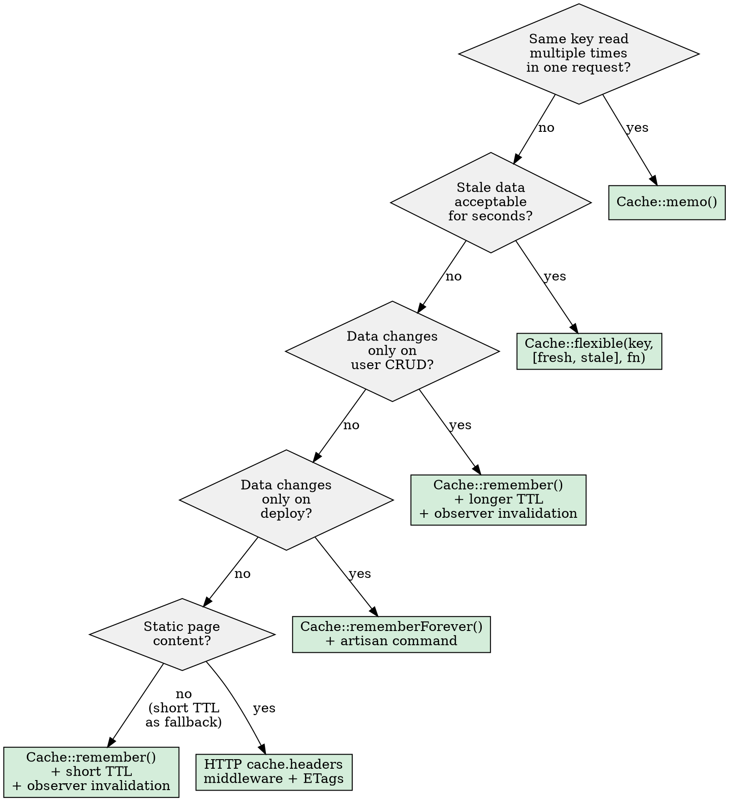

# Laravel 12+ Caching Expert

**Announce at start:** "I'm using the laravel-caching skill to apply caching best practices."

## Mode Detection

If the user asks to "review", "audit", or "check" existing code for caching opportunities, switch to **Review Mode** (see below). Otherwise, operate in **Implementation Mode** — apply caching best practices as you write or modify code.

## Cache Method Decision Tree

When deciding which cache method to use:



### Quick reference

| Scenario | Method | TTL | Invalidation |
|----------|--------|-----|-------------|
| Dashboard stats, listings | `Cache::flexible('key', [5, 10], fn)` | 5s fresh / 10s stale | Self-healing (background refresh) |
| User profile, settings | `Cache::remember('key', 300, fn)` | 5 min | Observer on `updated` |
| Product catalog | `Cache::remember()` + tags | 15-60 min | `Cache::tags(['products'])->flush()` on CRUD |
| App config, feature flags | `Cache::rememberForever('key', fn)` | Forever | Deploy script / artisan command |
| Terms, privacy, about | HTTP `cache.headers` middleware | `max_age=86400` | ETag auto-invalidates on content change |
| Same key in one request | Wrap with `Cache::memo()` | Request lifetime | Auto (per-request memory) |

## Cache Invalidation Rules

**ALWAYS define invalidation alongside cache creation.** Never add `Cache::remember()` without a corresponding invalidation path.

### Invalidation patterns

| Data type | Cache method | Invalidation strategy |
|-----------|-------------|----------------------|
| User-triggered CRUD | `remember()` + tags | Observer: `created/updated/deleted` → `Cache::tags()->flush()` |
| Aggregations/stats | `flexible()` | Self-healing (stale-while-revalidate, no manual invalidation needed) |
| Config/settings | `rememberForever()` | Deploy script or `php artisan cache:clear-tag` |
| Static pages | HTTP `cache.headers` | ETag auto-handles via response content hash |
| Computed/expensive | `remember()` + `memo()` | Event-driven + short TTL as safety net |

### Anti-patterns to flag

- `Cache::flush()` in application code — nukes entire cache store
- `Cache::forget()` key that doesn't match `Cache::remember()` key exactly
- Cache write in controller without invalidation in observer/listener
- `Cache::rememberForever()` without ANY invalidation path defined
- Missing cache tags on data that changes independently
- `Cache::remember()` on high-traffic endpoint where `Cache::flexible()` would eliminate the rebuild penalty

## Cache Layer Stack

When reviewing or setting up a Laravel 12+ project, ensure each layer is utilized:

1. **OPcache** — PHP bytecode cache. Always enabled.
2. **Framework cache** — `php artisan optimize` on every deploy (config, routes, views, events).
3. **Application cache** — `Cache::remember/flexible/memo`. Use Redis in production.
4. **Response cache** — `spatie/laravel-responsecache` for full GET responses on read-heavy endpoints.
5. **HTTP cache** — `cache.headers` middleware with ETags. Add `s_maxage` for CDN (Cloudflare/CloudFront).
6. **Octane interval cache** — `Cache::store('octane')->interval()` for Swoole workers.

### Laravel 12+ specific features

- **`Cache::memo()`** (12.9+): In-memory memoization per request. Use when same key accessed multiple times.
- **`Cache::flexible()`** (11.23+): Stale-while-revalidate. Eliminates "unlucky user" rebuild penalty.
- **`Cache::withoutOverlapping()`** (12.47+): Cleaner atomic lock API. Use for critical sections.
- **Failover driver**: Configure `'driver' => 'failover'` with fallback stores in `config/cache.php`.
- **xxHash**: Internal hashing upgraded from MD5 to xxh128 (30x faster for cache keys/etags).

### Failover configuration example

```php
// config/cache.php
'failover' => [
    'driver' => 'failover',
    'stores' => ['redis', 'database', 'array'],
],
```

## HTTP Cache Headers

For static or semi-static routes, use the built-in middleware:

```php
Route::middleware('cache.headers:public;max_age=30;s_maxage=300;stale_while_revalidate=600;etag')
    ->group(function () {
        Route::get('/terms', fn () => view('terms'));
        Route::get('/privacy', fn () => view('privacy'));
    });
```

Key directives: `public`, `private`, `max_age`, `s_maxage`, `stale_while_revalidate`, `etag`.

## Review Mode

When user asks to review/audit code for caching:

### Step 1: Scan target code
Read specified files. Identify all data access points (DB queries, API calls, computed values).

### Step 2: Evaluate each data access
- Is it cached? Should it be?
- Is the cache method appropriate per the decision tree?
- Is there an invalidation path matching the data type?
- Could `Cache::memo()` help? (same key read multiple times)
- Could `Cache::flexible()` replace `Cache::remember()`?

### Step 3: Check infrastructure
- Cache tags used where data changes independently?
- Failover configured for production?
- HTTP cache headers on static routes?
- `php artisan optimize` in deploy pipeline?

### Step 4: Output structured review

```
## Cache Review: [file/class name]

### Critical (must fix)
- [Issue]: [What's wrong] → [Fix with code snippet]

### Recommended (significant improvement)
- [Issue]: [What's wrong] → [Suggested approach]

### Optional (nice-to-have)
- [Minor optimization opportunities]

### Already Good
- [Acknowledge correct cache patterns]
```
